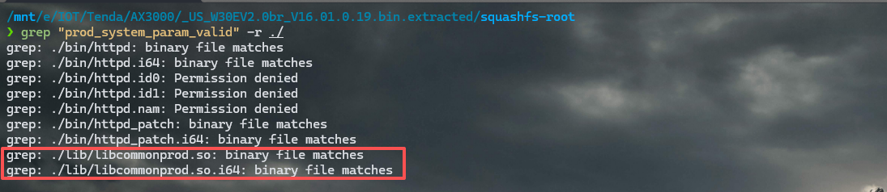
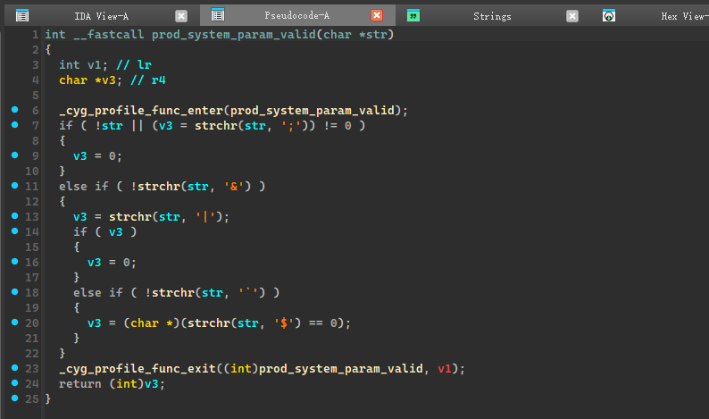
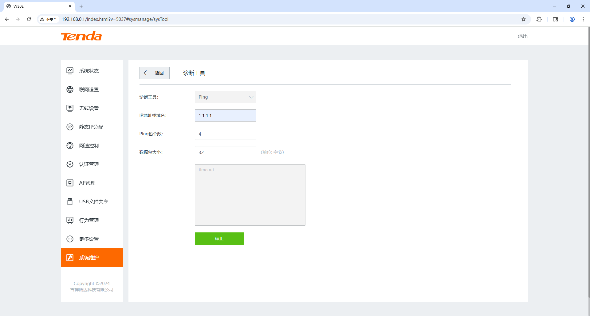
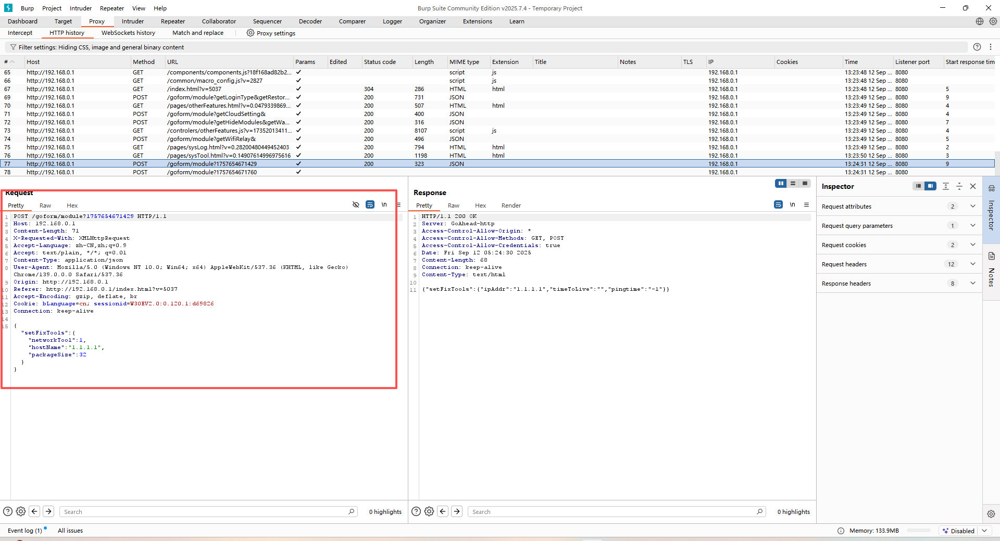
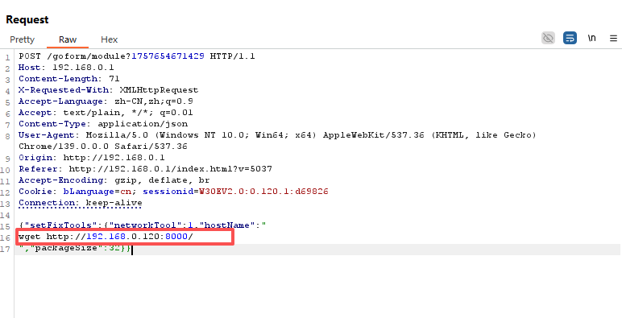
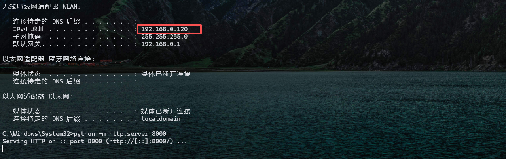
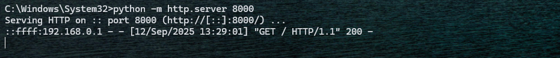
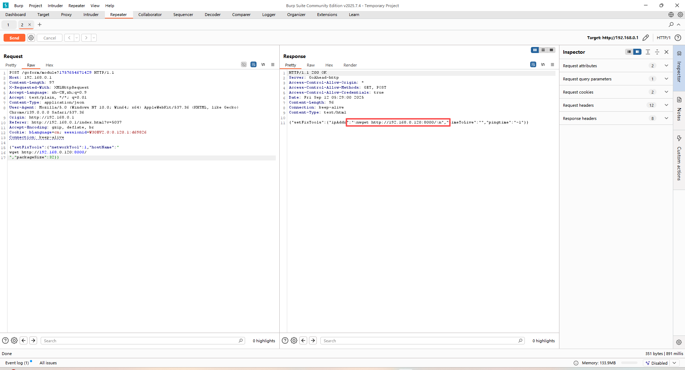

# Tenda W30E AX3000


Over 50,000 units of this product have been sold, meaning the vulnerability has a **wide impact scope**.

# Vulnerability Analysis

The vulnerability resides in the device's handling of the `ping` functionality.

```c
void __fastcall do_ping_action(cJSON *in, cJSON *out)
{
  int v2; // lr
  int String; // r0
  const char *v6; // r6
  char *v7; // r4
  cJSON_0 *v8; // r0
  cJSON_0 *Object; // r4
  cJSON_0 *v10; // r0
  cJSON_0 *v11; // r0
  cJSON_0 *v12; // r0
  char PingTime[16]; // [sp+8h] [bp-490h] BYREF
  char ttl[16]; // [sp+18h] [bp-480h] BYREF
  CMD_PING_CFG_STRU cfg; // [sp+28h] [bp-470h] BYREF
  char res_buf[1024]; // [sp+78h] [bp-420h] BYREF

  _cyg_profile_func_enter((int)do_ping_action, v2);
  memset(PingTime, 0, sizeof(PingTime));
  memset(ttl, 0, sizeof(ttl));
  memset(res_buf, 0, sizeof(res_buf));
  memset(&cfg, 0, sizeof(cfg));
  String = cJSON_GetString((int)in, (int)"hostName", 0);
  v6 = (const char *)String;
  if ( String && prod_system_param_valid(String) )
  {
    cfg.size = cJSON_GetInt((int)in, (int)"packageSize", 56);
    cfg.pro_version = cJSON_GetInt((int)in, (int)"pro_ver", 4);
    cfg.timeout = cJSON_GetInt((int)in, (int)"timeout", 1);
    cfg.count = 1;
    strncpy(cfg.hostname, v6, 0x3Fu);
    if ( cmd_get_ping_output(&cfg, res_buf, 1024) )
    {
      prod_debug("do_ping_action", 421, 2, "httpd", "Failed to get ping result, hostname=%s", v6);
    }
    else
    {
      if ( strstr(res_buf, "ttl") )
      {
        _isoc99_sscanf(res_buf, "%*[^=]=%*[^ ] %*[^=]=%[^ ] %*[^=]=%[^ ]", ttl, PingTime);
      }
      else
      {
        strcpy(res_buf, "host is unreachable!");
        strcpy(PingTime, "-1");
      }
      Object = cJSON_CreateObject();
      if ( Object )
      {
        v10 = cJSON_CreateString(v6);
        cJSON_AddItemToObject(Object, "ipAddr", v10);
        v11 = cJSON_CreateString(ttl);
        cJSON_AddItemToObject(Object, "timeToLive", v11);
        v12 = cJSON_CreateString(PingTime);
        cJSON_AddItemToObject(Object, "pingtime", v12);
        cJSON_AddItemToObject((cJSON_0 *)out, in->string, Object);
        goto LABEL_10;
      }
    }
  }
  v7 = in->string;
  v8 = cJSON_CreateString("fail");
  cJSON_AddItemToObject((cJSON_0 *)out, v7, v8);
LABEL_10:
  _cyg_profile_func_exit(do_ping_action);
}
```

Here you can see that the program will obtain the following data separately from the input we provided:

```c
    cfg.size = cJSON_GetInt((int)in, (int)"packageSize", 56);
    cfg.pro_version = cJSON_GetInt((int)in, (int)"pro_ver", 4);
    cfg.timeout = cJSON_GetInt((int)in, (int)"timeout", 1);
    cfg.count = 1;
    strncpy(cfg.hostname, v6, 0x3Fu);
```

However, there is a prior check on our input for `cfg.hostname` – it is passed to `prod_system_param_valid(String)`. From the function name, we can tell that this function is located in `libcommonprod.so`.



`prod_system_param_valid`



It can be observed that the `\n` (newline) character is not filtered out here. Therefore, we can attempt to perform **command injection**, and the analysis is as follows:

```c
UGW_RETURN_CODE_ENUM __fastcall cmd_get_ping_output(const CMD_PING_CFG_STRU *cfg, char *output, int o_size)
{
  int v3; // lr
  UGW_RETURN_CODE_ENUM v5; // r5
  FILE *v8; // r0
  FILE *v9; // r4
  int v10; // r4
  char *v11; // r0
  char new_cmd_buf[256]; // [sp+10h] [bp-120h] BYREF

  v5 = UGW_RETURN_CODE::UGW_OK;
  _cyg_profile_func_enter((int)cmd_get_ping_output, v3);
  memset(new_cmd_buf, 0, sizeof(new_cmd_buf));
  if ( cfg )
  {
    snprintf(
      new_cmd_buf,
      0x100u,
      "ping %s -%d -c %d -s %d -W %d -4",
      cfg->hostname,
      cfg->pro_version,
      cfg->count,
      cfg->size,
      cfg->timeout);
    v8 = popen(new_cmd_buf, "r");
    v9 = v8;
    if ( v8 )
    {
      fread(output, 1u, o_size - 1, v8);
      pclose(v9);
      goto LABEL_6;
    }
    v10 = *_errno_location();
    v11 = strerror(v10);
    prod_debug("cmd_get_ping_output", 269, 2, "httpd", "Failed(%d) to invalid cmd [%s], %s.", v10, new_cmd_buf, v11);
  }
  v5 = UGW_RETURN_CODE::UGW_ERR;
LABEL_6:
  _cyg_profile_func_exit(cmd_get_ping_output);
  return v5;
}
```

It can be observed that command concatenation is performed via `snprintf`, and the command is executed through `popen`. This means we can directly inject commands into the `hostname` parameter.

### Vulnerability Verification

First, capture the `ping`-related packet using Burp Suite.



We have obtained the packet that sends the `ping` parameter data.



Next, we'll use the Repeater tool to modify the `hostname` parameter and attempt command injection.



We will open an HTTP port here for monitoring.



Next, we'll send the command injection payload to launch the attack.





Command Injection Succeeded

