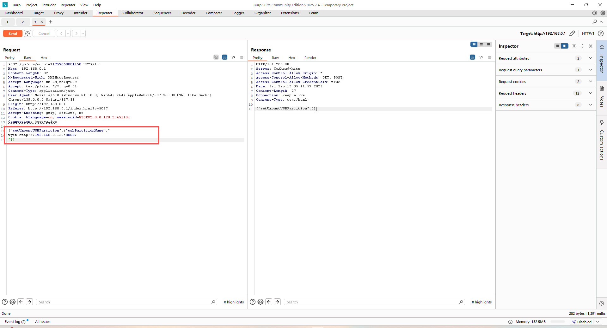
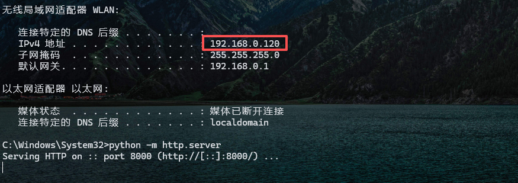
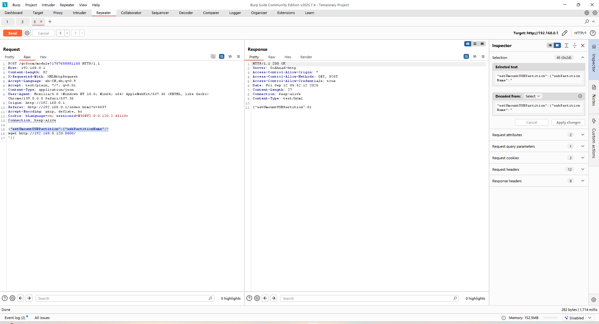
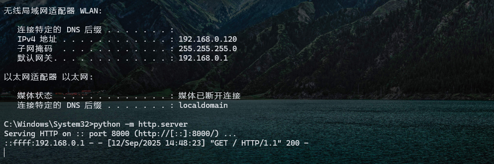

# Tenda W30E AX3000


Over 50,000 units of this product have been sold, meaning the vulnerability has a **wide impact scope**.

## 漏洞分析

`formSetUSBPartitionUmount`

```c
void __fastcall formSetUSBPartitionUmount(webs_t wp, cJSON *fromWebs, cJSON *toWebs)
{
  int v3; // lr
  const char *String; // r7
  char *v7; // r4
  double v8; // r0
  cJSON_0 *Number; // r0

  _cyg_profile_func_enter((int)formSetUSBPartitionUmount, v3);
  String = (const char *)cJSON_GetString((int)fromWebs, (int)"usbPartitionName", 0);
  if ( String )
  {
    if ( prod_system_param_valid() )
      doSystemCmd("/usr/sbin/usb umount %s", String);
    v7 = fromWebs->string;
    v8 = 0.0;
  }
  else
  {
    v7 = fromWebs->string;
    v8 = -1.0;
  }
  Number = cJSON_CreateNumber(v8);
  cJSON_AddItemToObject((cJSON_0 *)toWebs, v7, Number);
  _cyg_profile_func_exit(formSetUSBPartitionUmount);
}
```

It is evident that our input `usbPartitionName` will be executed as a command parameter. However, it needs to pass the validation of the `prod_system_param_valid()` function.

From the function name, we can tell that this function is located in the `libcommonprod.so` library.


`prod_system_param_valid`


It can be observed that the `\n` (newline) character is not filtered out here, so we can attempt command injection.

### Vulnerability Verification

Since the device only displays this port on the page when a USB device is mounted, we can directly modify the parameters manually to trigger the corresponding function.



The following JSON structure can be constructed to trigger the function:

```
{"setUmountUSBPartition":{"usbPartitionName":""}}
```

We can set up a local HTTP server and use a `wget` injection to verify if our command executes successfully.



We proceed with the attack and check if the device accesses our HTTP service.



The request was sent successfully, and the device has accessed the HTTP service on our PC.

