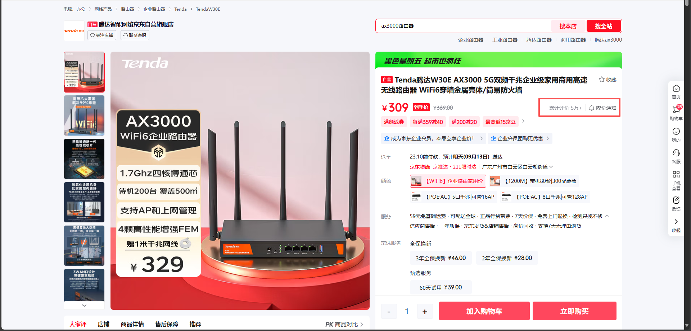
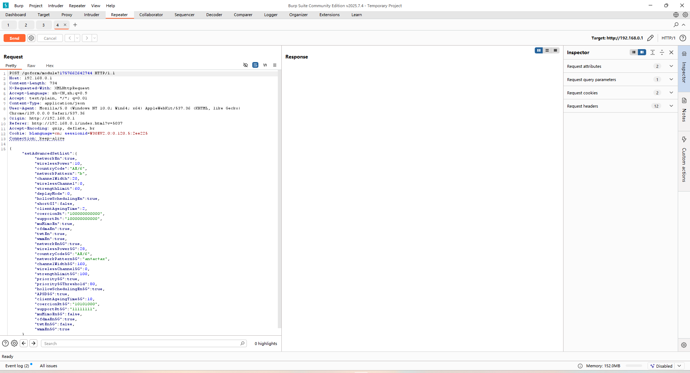
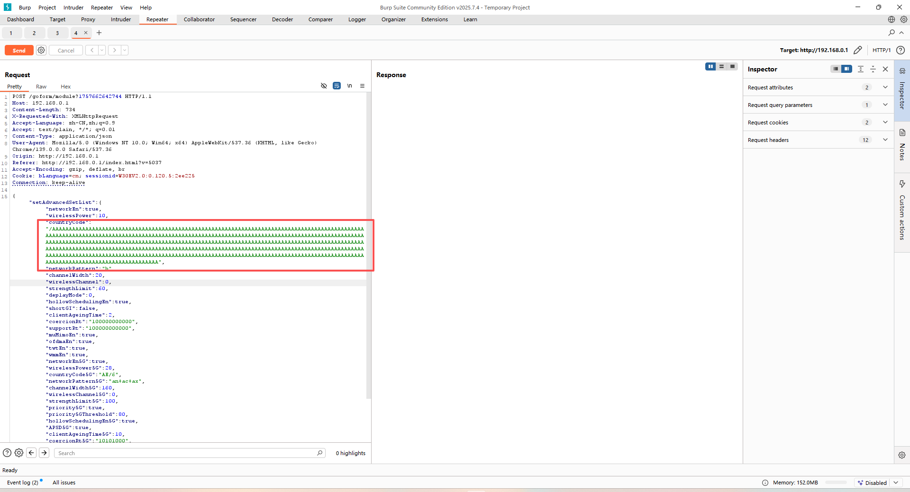
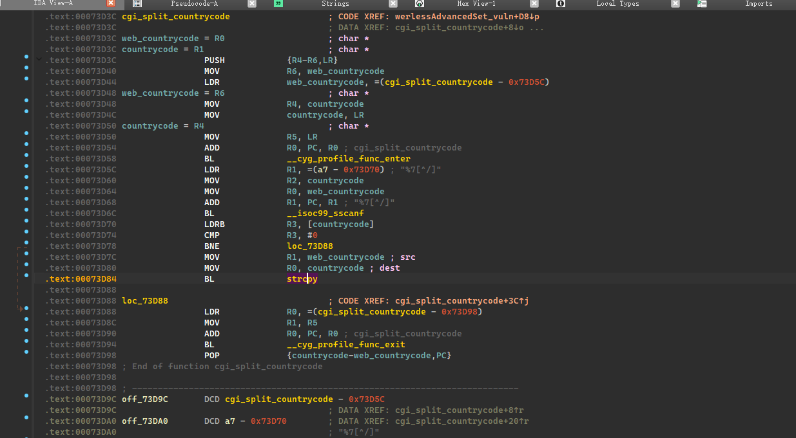
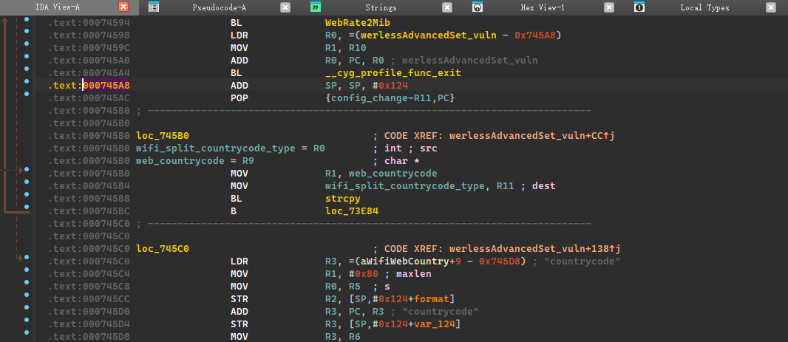
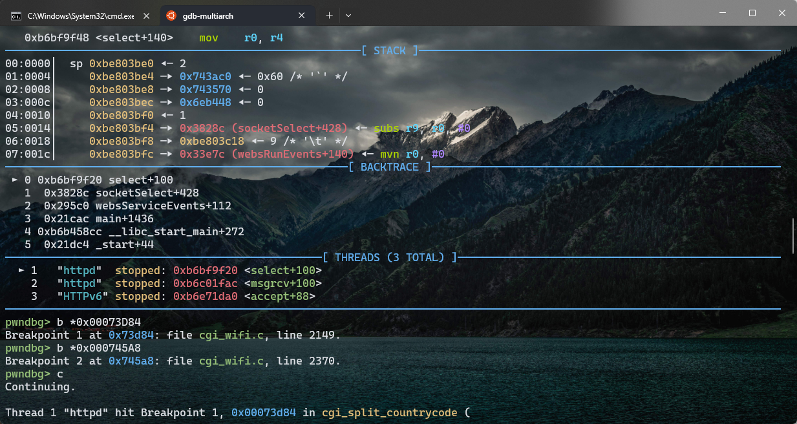
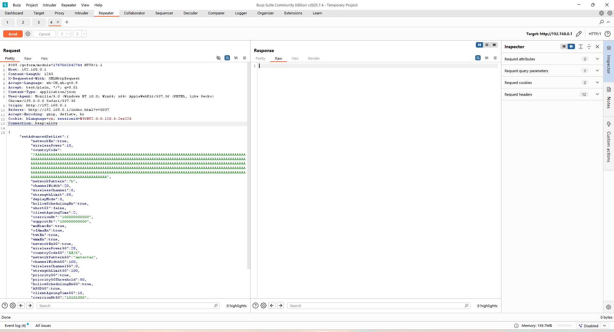
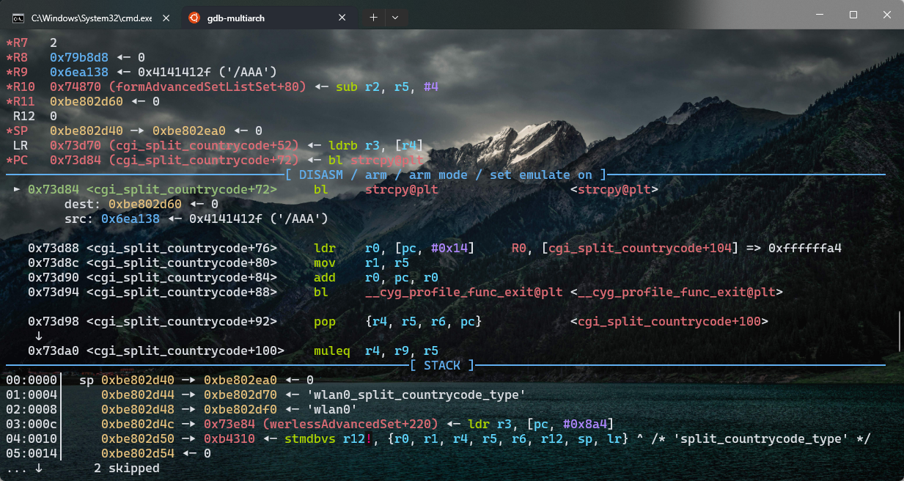
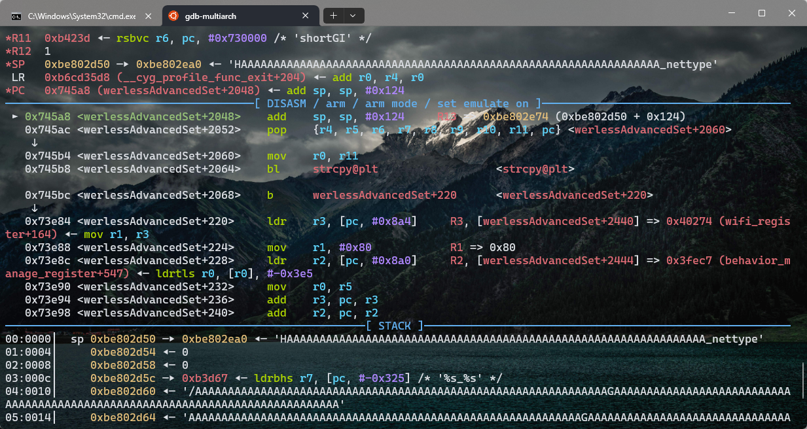
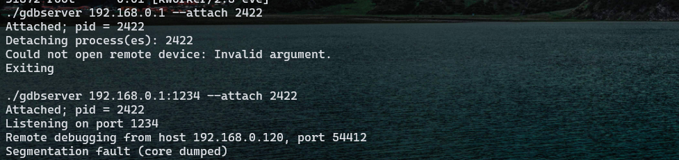

# Tenda W30E AX3000



Over 50,000 units of this product have been sold, meaning the vulnerability has a **wide impact scope**.

## Vulnerability Analysis

In the processing of `formAdvancedSetListSet`, the `werlessAdvancedSet` function is invoked.

```c
void __fastcall werlessAdvancedSet(WLAN_RATE_TYPE wl_rate, cJSON *fromWebs, int *config_change)
{
  int v3; // lr
  int v7; // r1
  char *String; // r9
  const char *driver_country_code; // r1
  char *v10; // r1
  int Bool; // r0
  int Int; // r11
  int radio_int_val; // r0
  char *v14; // r11
  int v15; // r0
  int v16; // r0
  int v17; // r0
  int v18; // r0
  int v19; // r0
  int v20; // r0
  int v21; // r0
  int v22; // r0
  int v23; // r0
  int v24; // r0
  int v25; // r0
  int v26; // r0
  int v27; // r0
  int v28; // r0
  int v29; // r0
  char *v30; // r5
  char *v31; // r0
  int v32; // r11
  int v33; // r0
  int v34; // r0
  int v35; // r0
  char countrycode[8]; // [sp+10h] [bp+0h] BYREF
  char dfs_channel_forced[8]; // [sp+18h] [bp+8h] BYREF
  char mibName[128]; // [sp+20h] [bp+10h] BYREF
  char prefix[132]; // [sp+A0h] [bp+90h] BYREF

  _cyg_profile_func_enter((int)werlessAdvancedSet_vuln, v3);
  memset(mibName, 0, sizeof(mibName));
  memset(countrycode, 0, sizeof(countrycode));
  memset(dfs_channel_forced, 0, sizeof(dfs_channel_forced));
  memset(prefix, 0, 0x80u);
  if ( wl_rate == wlan_rate_type::WLAN_RATE_24G )
    v7 = 2;
  else
    v7 = 4;
  getMibPrefix((int)prefix, v7, 0);
  String = wifi_cJSON_GetString(wl_rate, fromWebs, "countryCode");
  snprintf(mibName, 0x80u, "%s_%s", prefix, "split_countrycode_type");
  if ( prod_cfm_get_int_val(mibName) )
    cgi_split_countrycode(String, countrycode); // 待验证
  else
    strcpy(countrycode, String);                // 待验证
  snprintf(mibName, 0x80u, "%s_%s", prefix, "wifi_web_countrycode");
  *config_change += prod_cfm_set_val((int)mibName, (int)String);
  if ( !strcmp(countrycode, "ALL") )
  {
    snprintf(mibName, 0x80u, "%s_%s", prefix, "countrycode");
    *config_change += prod_cfm_set_val((int)mibName, (int)"CN");
    snprintf(mibName, 0x80u, "%s_%s", prefix, "countrycode_all");
    v10 = "1";
  }
  else
  {
    snprintf(mibName, 0x80u, "%s_%s", prefix, "countrycode");
    driver_country_code = (const char *)get_driver_country_code(countrycode);
    if ( driver_country_code )
      strncpy(countrycode, driver_country_code, 8u);
    *config_change += prod_cfm_set_val((int)mibName, (int)countrycode);
    snprintf(mibName, 0x80u, "%s_%s", prefix, "countrycode_other");
    *config_change += prod_cfm_set_val((int)mibName, (int)"1");
    snprintf(mibName, 0x80u, "%s_%s", prefix, "countrycode_all");
    v10 = "0";
  }
  *config_change += prod_cfm_set_val((int)mibName, (int)v10);
  prod_get_dfs_channel_forced(countrycode, 0, dfs_channel_forced);
  snprintf(mibName, 0x80u, "%s_%s", prefix, "countryrev");
  *config_change += prod_cfm_set_int_val(mibName, 0);
  snprintf(mibName, 0x80u, "%s_%s", prefix, "dfs");
  if ( prod_cfm_get_int_val(mibName, 0) )
  {
    snprintf(mibName, 0x80u, "%s_%s", prefix, "dfs_channel_forced");
    *config_change += prod_cfm_set_val((int)mibName, (int)dfs_channel_forced);
  }
  snprintf(mibName, 0x80u, "%s_%s", prefix, "enable");
  Bool = wifi_cJSON_GetBool(wl_rate, fromWebs, "networkEn");
  *config_change += prod_cfm_set_int_val(mibName, Bool);
  snprintf(mibName, 0x80u, "%s_%s", prefix, "curpower");
  Int = wifi_cJSON_GetInt(wl_rate, fromWebs, "wirelessPower");
  radio_int_val = wifi_get_radio_int_val(wl_rate, "power_compensate");
  *config_change += prod_cfm_set_int_val(mibName, Int - radio_int_val);
  memset(mibName, 0, sizeof(mibName));
  v14 = wifi_cJSON_GetString(wl_rate, fromWebs, "networkPattern");
  v15 = wifi_get_mibname((int)prefix, (int)"nettype", (int)mibName);
  *config_change += prod_cfm_set_val(v15, (int)v14);
  snprintf(mibName, 0x80u, "%s_%s", prefix, "channel");
  v16 = wifi_cJSON_GetInt(wl_rate, fromWebs, "wirelessChannel");
  *config_change += prod_cfm_set_int_val(mibName, v16);
  snprintf(mibName, 0x80u, "%s_%s", prefix, "bandwidth");
  v17 = wifi_cJSON_GetInt(wl_rate, fromWebs, "channelWidth");
  *config_change += prod_cfm_set_int_val(mibName, v17);
  snprintf(mibName, 0x80u, "%s_%s", prefix, "cutrssi");
  v18 = wifi_cJSON_GetInt(wl_rate, fromWebs, "strengthLimit");
  v19 = turn(v18);
  *config_change += prod_cfm_set_int_val(mibName, v19);
  snprintf(mibName, 0x80u, "%s_%s", prefix, "rssi_enable");
  *config_change += prod_cfm_set_int_val(mibName, 1);
  snprintf(mibName, 0x80u, "%s_%s", prefix, "atf");
  v20 = wifi_cJSON_GetBool(wl_rate, fromWebs, "hollowSchedulingEn");
  *config_change += prod_cfm_set_int_val(mibName, v20);
  snprintf(mibName, 0x80u, "%s_%s", prefix, "txbf_mu_fake");
  v21 = wifi_cJSON_GetBool(wl_rate, fromWebs, "muMimoEn");
  *config_change += prod_cfm_set_int_val(mibName, v21);
  snprintf(mibName, 0x80u, "%s_%s", prefix, "ofdma_mode_fake");
  v22 = wifi_cJSON_GetBool(wl_rate, fromWebs, "ofdmaEn");
  *config_change += prod_cfm_set_int_val(mibName, v22);
  snprintf(mibName, 0x80u, "%s_%s", prefix, "twt_enable");
  v23 = wifi_cJSON_GetBool(wl_rate, fromWebs, "twtEn");
  *config_change += prod_cfm_set_int_val(mibName, v23);
  snprintf(mibName, 0x80u, "%s_%s", prefix, "wmm_enable");
  v24 = wifi_cJSON_GetBool(wl_rate, fromWebs, "wmmEn");
  *config_change += prod_cfm_set_int_val(mibName, v24);
  if ( wl_rate == wlan_rate_type::WLAN_RATE_24G )
  {
    snprintf(mibName, 0x80u, "%s_%s", prefix, "sgi_tx_fake");
    v25 = wifi_cJSON_GetBool(wlan_rate_type::WLAN_RATE_24G, fromWebs, "shortGI");
    *config_change += prod_cfm_set_int_val(mibName, v25);
    snprintf(mibName, 0x80u, "%s_%s", prefix, "sgi_rx");
    v26 = wifi_cJSON_GetBool(wlan_rate_type::WLAN_RATE_24G, fromWebs, "shortGI");
    *config_change += prod_cfm_set_int_val(mibName, v26);
    snprintf(mibName, 0x80u, "%s_%s", prefix, "interference");
    v27 = wifi_cJSON_GetInt(wlan_rate_type::WLAN_RATE_24G, fromWebs, "deplayMode");
    v28 = set_wifi_deploy_mode(wlan_rate_type::WLAN_RATE_24G, v27);
  }
  else
  {
    if ( wl_rate != wlan_rate_type::WLAN_RATE_5G )
      goto LABEL_15;
    snprintf(mibName, 0x80u, "%s_%s", prefix, "ssid5g_prio");
    v32 = wifi_cJSON_GetBool(wlan_rate_type::WLAN_RATE_5G, fromWebs, "priority");
    *config_change += prod_cfm_set_int_val(mibName, v32);
    if ( v32 )
    {
      snprintf(mibName, 0x80u, "%s_%s", prefix, "ssid5g_priorssi");
      v33 = cJSON_GetInt((int)fromWebs, (int)"priority5GThreshold", 0);
      v34 = turn(v33);
      *config_change += prod_cfm_set_int_val(mibName, v34);
    }
    snprintf(mibName, 0x80u, "%s_%s", prefix, "wmm_apsd");
    v35 = wifi_cJSON_GetBool(wlan_rate_type::WLAN_RATE_5G, fromWebs, "APSD");
    v28 = prod_cfm_set_int_val(mibName, v35);
  }
  *config_change += v28;
LABEL_15:
  snprintf(mibName, 0x80u, "%s_%s", prefix, "expire_time");
  v29 = wifi_cJSON_GetInt(wl_rate, fromWebs, "clientAgeingTime");
  *config_change += prod_cfm_set_int_val(mibName, 60 * v29);
  v30 = wifi_cJSON_GetString(wl_rate, fromWebs, "coercionRt");
  v31 = wifi_cJSON_GetString(wl_rate, fromWebs, "supportRt");
  WebRate2Mib(wl_rate, prefix, v30, v31, config_change);
  _cyg_profile_func_exit(werlessAdvancedSet_vuln);
}
```

We can see there's a `strcpy` function here, and we can trace the source of its input.

```c
String = wifi_cJSON_GetString(wl_rate, fromWebs, "countryCode");

char *__fastcall wifi_cJSON_GetString(WLAN_RATE_TYPE wl_rate, cJSON *root, char *json_name)
{
  int v3; // lr
  char *String; // r4
  char *v9; // r3
  char name[128]; // [sp+0h] [bp-98h] BYREF

  _cyg_profile_func_enter((int)wifi_cJSON_GetString, v3);
  memset(name, 0, sizeof(name));
  if ( wl_rate != wlan_rate_type::WLAN_RATE_24G )
  {
    v9 = json_name;
    json_name = name;
    snprintf(name, 0x80u, "%s5G", v9);
  }
  String = (char *)cJSON_GetString((int)root, (int)json_name, (int)&byte_AD4B7);
  _cyg_profile_func_exit(wifi_cJSON_GetString);
  return String;
}

int __fastcall cgi_split_countrycode(char *web_countrycode, char *countrycode)
{
  int v2; // lr

  _cyg_profile_func_enter((int)cgi_split_countrycode, v2);
  _isoc99_sscanf(web_countrycode, "%7[^/]", countrycode);
  if ( !*countrycode )
    strcpy(countrycode, web_countrycode);
  return _cyg_profile_func_exit(cgi_split_countrycode);
}
```

From this analysis, we can see that if `prod_cfm_get_int_val(mibName)` returns a value not equal to 0, it will execute `cgi_split_countrycode`. However, `cgi_split_countrycode` itself contains a vulnerability:

```
_isoc99_sscanf(web_countrycode, "%7[^/]", countrycode);
```

If this returns 0 (meaning it doesn't meet the `scanf` reading requirements), it will still call `strcpy`. The `countrycode` variable is located on the stack in `werlessAdvancedSet`, creating a potential attack vector.

## 验证漏洞

We can use a string like `/AAAAAAAA.....` to bypass `_isoc99_sscanf` and then modify the `countrycode` data in the captured packet using Burp Suite. Here's how to do it:



Now, we'll set the `countrycode` parameter to the crafted string we discussed, which is designed to bypass `_isoc99_sscanf` and trigger the stack overflow via `strcpy`.



To observe the stack overflow behavior and verify the vulnerability, we can use `gdbserver` to remotely attach to the target device and set breakpoints at key locations. Here's how to proceed:



Once the breakpoints are hit in GDB, we can verify whether the stack overflow was successful through the following observations and debugging operations:



To connect via GDB and set breakpoints for debugging the stack overflow vulnerability



并burp直接发送含有对应`payload`的数据包



Here we can see that it has entered the `strcpy` function within `cgi_split_countrycode`.



Then we execute `c` (continue) to check if our return address has been overwritten.



Then we continue executing the command, and we can see that the program has crashed.



Verification successful.