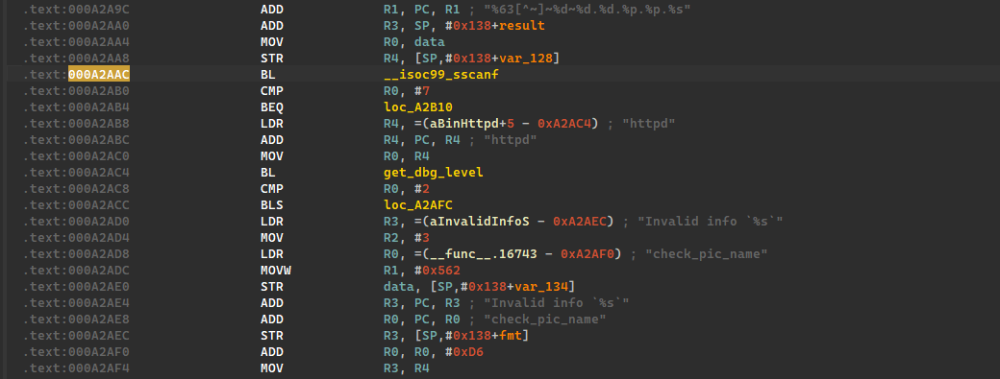
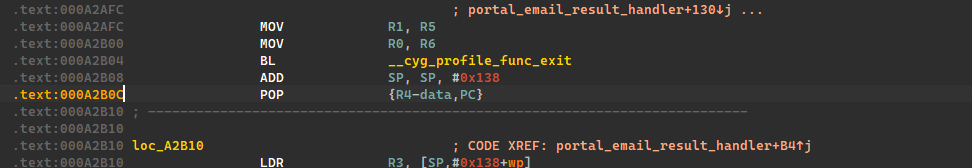
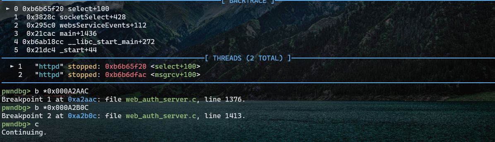
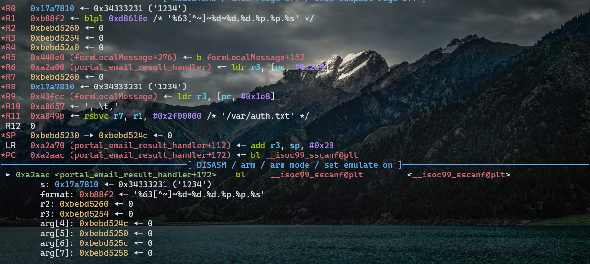
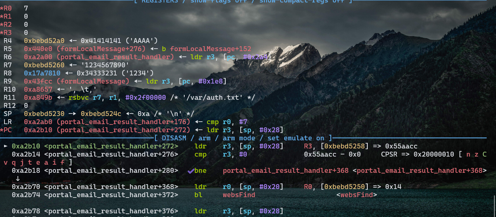
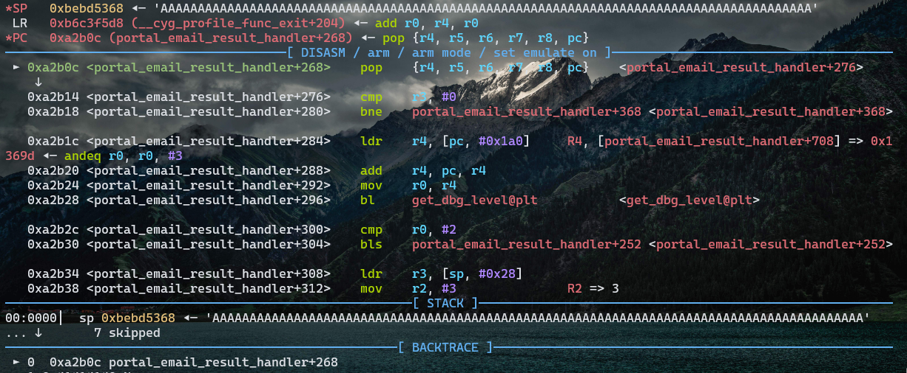
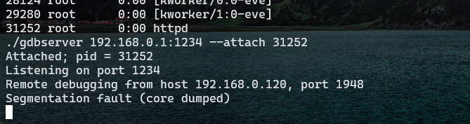

# Tenda W30E AX3000


Over 50,000 units of this product have been sold, meaning the vulnerability has a **wide impact scope**.

## Vulnerability Analysis

The vulnerability lies in the improper handling of incoming parameters within the `portal_email_result_handler` function.

```c
void __fastcall portal_email_result_handler(char *data)
{
  int v1; // lr
  Webs *v3; // r0
  WebsSocket *v4; // r0
  char *fmt; // [sp+0h] [bp-30h]
  int test; // [sp+1Ch] [bp-14h] BYREF
  int wid; // [sp+20h] [bp-10h] BYREF
  int result; // [sp+24h] [bp-Ch] BYREF
  webs_t wp; // [sp+28h] [bp-8h] BYREF
  WebsSocket *spb; // [sp+2Ch] [bp-4h] BYREF
  char email_account[64]; // [sp+30h] [bp+0h] BYREF
  char name[200]; // [sp+70h] [bp+40h] BYREF

  _cyg_profile_func_enter((int)portal_email_result_handler, v1);
  test = 0;
  wid = 0;
  result = 0;
  wp = 0;
  spb = 0;
  memset(email_account, 0, sizeof(email_account));
  memset(name, 0, sizeof(name));
  if ( _isoc99_sscanf(data, "%63[^~]~%d~%d.%d.%p.%p.%s", email_account, &result, &test, &wid, &spb, &wp, name) == 7 )// 栈溢出
  {
    if ( wp && (v3 = (Webs *)websFind(wid), v3 == wp) )
    {
      v4 = socketPtr(v3->sid);
      if ( v4 && spb == v4 )
      {
        if ( result == 1 )
        {
          tdSyslog(1, "Failed to connect SMTP server.");
        }
        else if ( result == 2 )
        {
          tdSyslog(1, "Failed to send email to %s.", email_account);
        }
        else if ( result && (unsigned int)get_dbg_level("httpd") > 2 )
        {
          prod_debug("portal_email_result_handler", 1406, 3, "httpd", "Unexpected result: %d", result);
        }
        outputToWebs(wp, fmt);
        websPump((Webs_1 *)wp);
      }
      else if ( (unsigned int)get_dbg_level("httpd") > 2 )
      {
        prod_debug("portal_email_result_handler", 1391, 3, "httpd", "sid %d not found (result=%d)", wid, result);
      }
    }
    else if ( (unsigned int)get_dbg_level("httpd") > 2 )
    {
      prod_debug("portal_email_result_handler", 1384, 3, "httpd", "wid %d mismatch wp %p", wid, wp);
    }
  }
  else if ( (unsigned int)get_dbg_level("httpd") > 2 )
  {
    prod_debug("portal_email_result_handler", 1378, 3, "httpd", "Invalid info `%s`", data);
  }
  _cyg_profile_func_exit(portal_email_result_handler);
}
```

The function is located in `formLocalMessage`. Here, it reads two parameters `msg` and `data` passed via the GET method. Among them, `data` is the data passed in, and it can be seen that there is no length restriction on `data`.

```c
void __fastcall formLocalMessage(webs_t wp, char_t *path, char_t *query)
{
  int v3; // lr
  char *Var; // r4
  char *v6; // r5
  int v7; // r0
  int v8; // r0
  int v9; // r0
  int v10; // r0
  char *v11; // [sp+0h] [bp-28h]
  char_t *v12; // [sp+4h] [bp-24h]

  v11 = (char *)wp;
  v12 = path;
  _cyg_profile_func_enter((int)formLocalMessage, v3);
  Var = websGetVar((Webs_1 *)wp, "msg", &byte_AD4B7);
  v6 = websGetVar((Webs_1 *)wp, "data", &byte_AD4B7);
  if ( v6 )
  {
    if ( !strcmp(Var, "response") )
    {
      response_to_web(v6);
    }
    else if ( !strcmp(Var, "portal.auth.result") )
    {
      portal_auth_result_handler(v6);
    }
    else if ( !strcmp(Var, "auth.sms.result") )
    {
      portal_email_result_handler(v6);
    }
    else if ( !strcmp(Var, "auth.email.result") )
    {
      portal_email_result_handler(v6);
    }
    else if ( !strcmp(Var, "portal.ip.changed") )
    {
      handle_portal_ip_changed();
    }
    else if ( !strcmp(Var, "reset.wan.num") )
    {
      v7 = atoi(v6);
      setMultiWan(v7);
    }
    else if ( !strcmp(Var, "start.wan.detect") )
    {
      if ( !wan_detect_flag_16699 )
      {
        wan_detect_flag_16699 = 1;
        v8 = atoi(v6);
        v9 = prod_detect_wan_type(v8);
        v10 = prod_cfm_set_int_val("wan_detect_rst", v9);
        prod_cfm_commit(v10);
        wan_detect_flag_16699 = 0;
      }
    }
    else
    {
      prod_debug("formLocalMessage", 434, 2, "httpd", "Unknown msg: %s", Var);
    }
    outputToWebs(wp, v11, v12, query);
  }
  _cyg_profile_func_exit(formLocalMessage);
}
```

# Vulnerability Verification

We need to bypass the parameter restrictions of the `scanf` function using the following payload:

```c
1234567890~42~10.20.0x7ffd1044.0x55aacc.AAAAAAAAAAAAAAAAAAAAA.....
```

The trigger point, as determined through analysis, is `/goform/localMsg`, and we'll pass parameters using the GET method.

Here, we'll set breakpoints at the address where `_isoc99_sscanf` is called and at the address where the processing function ends.





The `gdbserver` has been successfully connected, and breakpoints have been set.



The program has stopped at the breakpoint.



The conditions are satisfied, and the return value is 7.

Check if the return address has been overwritten.



It can be seen that the return address has been overwritten, and an error is popped up.



